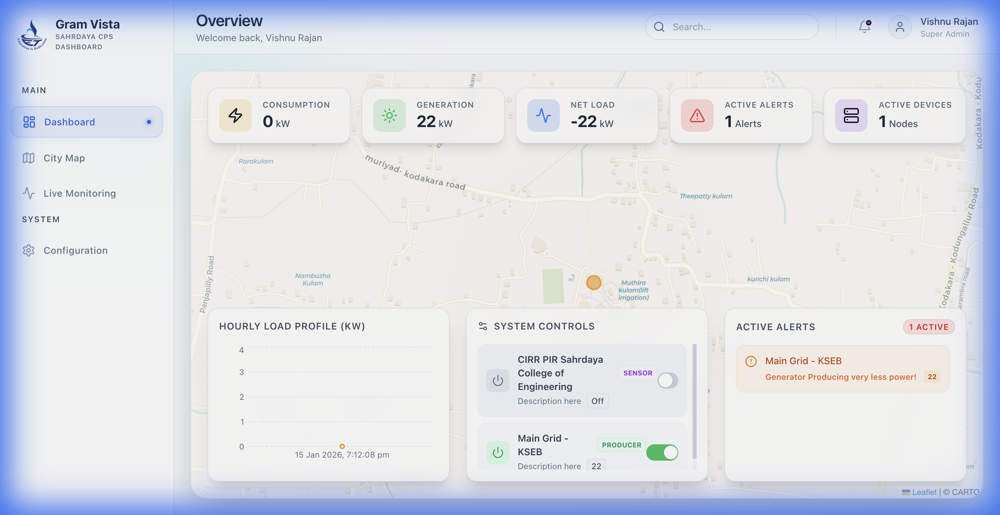

# Gram Vista: Sahrdaya CPS Digital Twin Dashboard


A state-of-the-art Digital Twin interface for monitoring and controlling Cyber-Physical Systems (CPS) such as smart energy grids, water networks, and environmental sensors. Built with React and powered by Firebase Realtime Database for sub-millisecond data synchronization.

**Live Demo**: [https://drvishnurajan.github.io/cps/](https://drvishnurajan.github.io/cps/)

---

## 🚀 Features

### 1. Real-Time Monitoring
View live telemetry from hundreds of IoT sensors across the campus.
- **Energy**: Solar array output, battery levels, feeder status.
- **Water**: Tank levels, flow rates, pump status.
- **Incidents**: Traffic congestion alerts, sensor timeouts.

### 2. Interactive Digital Twin Map
A Leaflet-based map visualizing the geolocation of all assets.
- **Filtering**: Switch layers to focus on Energy Grid, Water Network, or System Controls.
- **Status Indicators**: Color-coded markers (Red=Critical, Amber=Warning, Green=Normal).

### 3. Bi-Directional System Control
Control physical actuators directly from the dashboard. Toggling a switch updates Firebase instantly, which can trigger your IoT device.
- **Street Lights**: Remote On/Off.
- **Irrigation Pumps**: Remote activation.
- **Generators**: Status control.


---

## 🛠 IoT Integration Guide

The dashboard uses **Firebase Realtime Database** as the broker between the UI and your physical devices.

### 1. Data Structure
All devices are stored under the `/assets` node. Each device has a unique ID (e.g., `E-01`, `W-02`).

**Schema Reference:**
```json
{
  "assets": {
    "E-01": {
      "id": "E-01",
      "type": "Main Substation",
      "category": "energy",      // 'energy', 'water', 'controls', 'incidents'
      "val": "482kW",            // Display value
      "status": "normal",        // 'normal', 'warning', 'critical', 'offline'
      "coords": [10.359, 76.285],// [Latitude, Longitude]
      "details": "Grid Connection"
    },
    "C-01": {
      "id": "C-01",
      "type": "Street Lights",
      "category": "controls",
      "val": "Off",              // Actuator State: 'Active' / 'Off' or 'On' / 'Off'
      "status": "offline"
    }
  }
}
```

### 2. Connecting Sensors (Upload Data)
Your IoT device (ESP32, Raspberry Pi, Python script) should write to the database whenever a reading changes.

**Example (Node.js / Python):**
```javascript
// Update Sensor Reading
firebase.database().ref('assets/E-01').update({
  val: "495kW",
  status: "normal"
});
```

### 3. Controlling Devices (Listen for Commands)
To control a device (e.g., Turn on Street Lights), your device must **subscribe** to changes on its specific node.

**Logic Flow:**
1.  User clicks "Toggle" on Dashboard.
2.  Dashboard updates `assets/C-01/val` to `"Active"`.
3.  IoT Device receives update event.
4.  IoT Device triggers physical relay.

**Example (Arduino/ESP32 Code Logic):**
```cpp
// Pseudo-code for ESP32 Firebase Client
if (Firebase.getString(firebaseData, "/assets/C-01/val")) {
  String state = firebaseData.stringData();
  if (state == "Active" || state == "On") {
    digitalWrite(RELAY_PIN, HIGH); // Turn Light ON
  } else {
    digitalWrite(RELAY_PIN, LOW);  // Turn Light OFF
  }
}
```

---

## 🖥 Dashboard Sections

### Main Dashboard

- **KPI Board**: Aggregated stats (Total Energy Load, Active Alerts).
- **Hourly Load**: Real-time chart of power consumption.
- **Active Alerts**: Scrollable list of systems reporting 'warning' or 'critical' status.

### City Map
Located in the sidebar, the Map View offers a full-screen geospatial perspective.
- **Energy Layer**: Visualizes power infrastructure.
- **Water Layer**: Visualizes tanks and pipes.
- **System Controls**: Overlay panel to toggle system states while viewing their location.

---

## 🔧 Technology Stack

- **Frontend**: React 18, Vite
- **Styling**: Tailwind CSS, Lucide Icons
- **Mapping**: React Leaflet, OpenStreetMap
- **Data**: Firebase Realtime Database
- **Charts**: Recharts

## 📦 Deployment

The project is deployed via GitHub Pages.
- **Build Command**: `npm run build` (Outputs to `dist/cps`)
- **Deploy Command**: `npm run deploy` (Pushes to `master` branch)

---
*Developed for Sahrdaya College of Engineering & Technology - CPS Department.*
